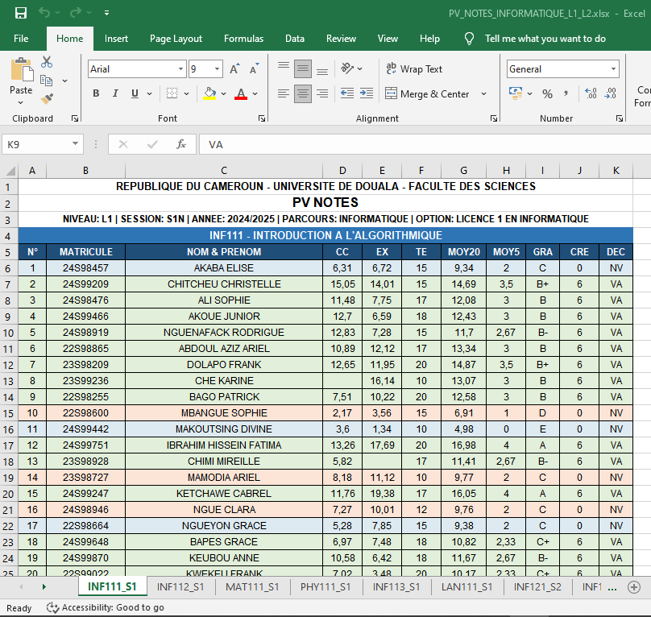
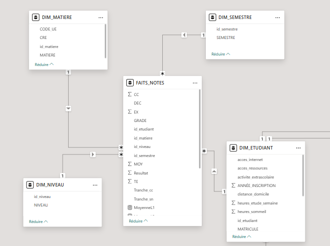
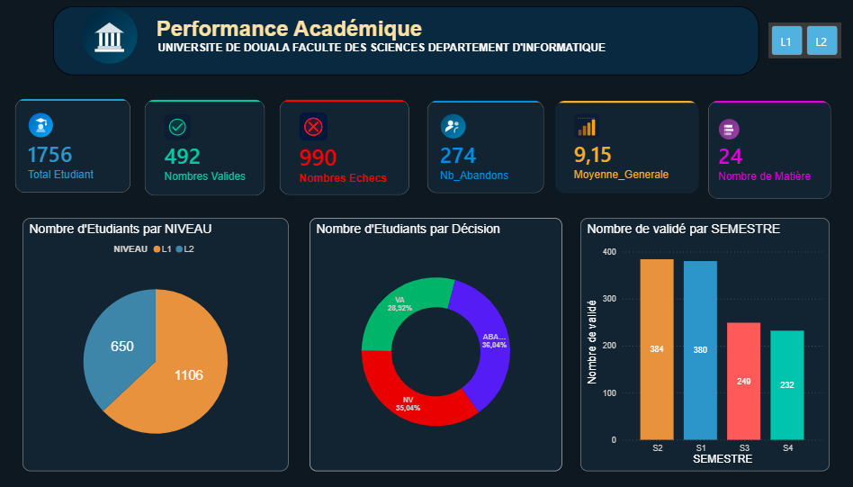
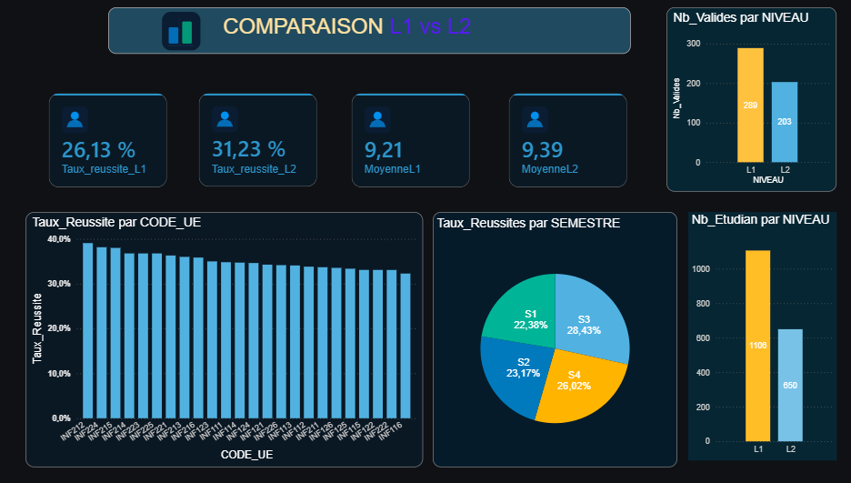
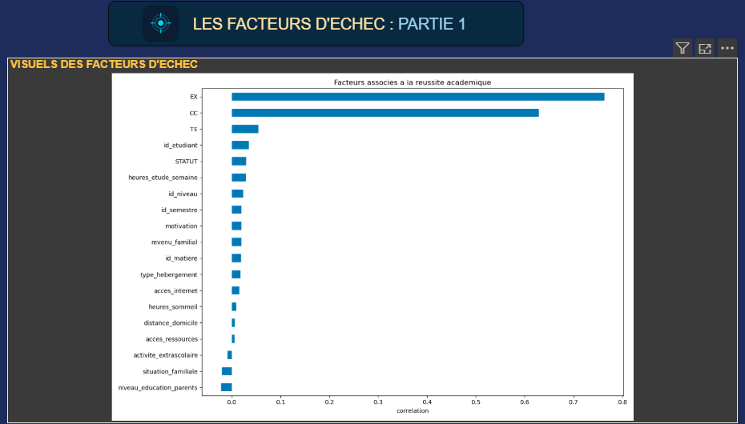
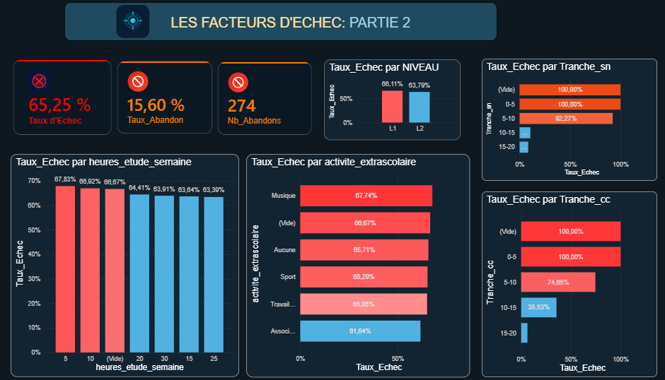

# Système d'Aide à la Décision et Prédiction des Tendances de Réussite des Étudiants

## Présentation

Ce projet a pour objectif de développer un système d'aide à la décision permettant d'analyser les performances académiques des étudiants, d'identifier les facteurs influençant leur réussite et de prédire les tendances de réussite grâce au Machine Learning.

Le projet combine la Business Intelligence (Power BI) et le Machine Learning afin d'offrir aux responsables académiques un outil d'analyse et d'aide à la prise de décision.

---

# Objectifs

## Objectif 1 : Analyse descriptive

* Analyser les performances académiques des étudiants.
* Calculer les principaux indicateurs de réussite.
* Identifier les matières les plus difficiles.
* Suivre les résultats par semestre et par niveau.

## Objectif 2 : Tableau de bord décisionnel

Concevoir des tableaux de bord interactifs permettant de visualiser :

* Nombre total d'étudiants.
* Nombre d'étudiants validés.
* Nombre d'étudiants non validés.
* Nombre d'abandons.
* Taux de réussite.
* Taux d'échec.
* Taux d'abandon.
* Moyenne générale.
* Répartition par niveau.
* Répartition par semestre.
* Analyse des matières.
* Influence des facteurs socio-économiques.

## Objectif 3 : Prédiction des tendances de réussite

Développer un modèle de Machine Learning capable d'anticiper les tendances de réussite académique des étudiants à partir des résultats scolaires et des variables socio-économiques.

---

# Technologies utilisées

* Power BI Desktop
* Power Query
* DAX
* Python
* Pandas
* NumPy
* Scikit-learn
* Matplotlib
* Joblib

---

# Structure du projet interne

```text
Projet/
│
├── Data/
│   ├── Fait_Notes
│   ├── Fact_Resultat
│   ├── Dataset_ML
│   ├── Dim_Etudiant
│   ├── Dim_Matiere
│   ├── Dim_Semestre
│   └── Dim_Niveau
│
├── Dashboard/
│   ├── Vue_Generale
│   ├── Comparaison L1/L2
│   ├── Facteur d'échec 1
│   └── Facteur d'échec 2
│
├── Machine_Learning/
│   ├── preprocessing.py
│   ├── training.py
│   ├── prediction.py
│   ├── model.pkl
│   └── evaluation.py
│
└── README.md
```

---

# Modèle de données

Le projet est organisé autour d'un modèle en étoile.

## Dimensions

* Dim_Etudiant
* Dim_Matiere
* Dim_Semestre
* Dim_Niveau

## Tables de faits

### Fait_Notes

Une ligne représente les notes d'un étudiant pour une matière donnée.

Principales colonnes :

* id_etudiant
* id_matiere
* id_semestre
* id_niveau
* CC
* SN
* TE
* Moy
* Decision

### Fact_Resultat

Une ligne représente le résultat global d'un étudiant pour un semestre.

Principales colonnes :

* id_etudiant
* id_semestre
* id_niveau
* Moy_Générale
* Nb_Matières
* Nb_Abandons
* Statut

### Dataset_ML

Une ligne représente un étudiant avec l'ensemble de ses variables explicatives.

Il contient :

* Variables socio-économiques.
* Notes pivotées.
* Variables académiques.
* Variable cible (Statut).

---

# Pipeline ETL

1. Importation des données.
2. Nettoyage des données.
3. Gestion des valeurs manquantes.
4. Création des dimensions.
5. Construction de Fact_Notes.
6. Construction de Fact_Resultat.
7. Préparation du Dataset_ML.
8. Entraînement du modèle.
9. Évaluation.
10. Déploiement des tableaux de bord.

---

# Tableaux de bord

## Vue d'ensemble

* Nombre d'étudiants.
* Nombre de validés.
* Nombre de non validés.
* Nombre d'abandons.
* Taux de réussite.
* Moyenne générale.

## Analyse académique

* Moyenne par matière.
* Distribution des notes.
* Évolution des moyennes.
* Comparaison CC, SN et TE.
* Matières les plus difficiles.

## Analyse socio-économique

* Réussite selon l'âge.
* Réussite selon le niveau.
* Réussite selon le semestre.
* Influence des variables sociales.

## Prédiction

* Probabilité de réussite.
* Importance des variables.
* Matrice de confusion.
* Accuracy.
* Precision.
* Recall.
* F1-score.
* Courbe ROC.

---

# Méthodologie Machine Learning

1. Préparation des données.
2. Encodage des variables catégorielles.
3. Standardisation des variables numériques.
4. Découpage Entraînement/Test.
5. Entraînement du modèle.
6. Validation croisée.
7. Évaluation des performances.
8. Prédiction.

---

# Résultats attendus

* Identification des étudiants à risque.
* Amélioration du suivi pédagogique.
* Réduction du taux d'échec.
* Aide à la prise de décision.
* Visualisation interactive des indicateurs académiques.
* Prédiction des tendances de réussite.

# Auteur
Njom Alphonse


#Visualisation






